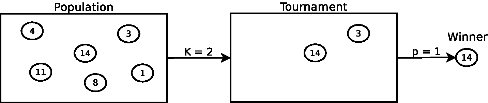
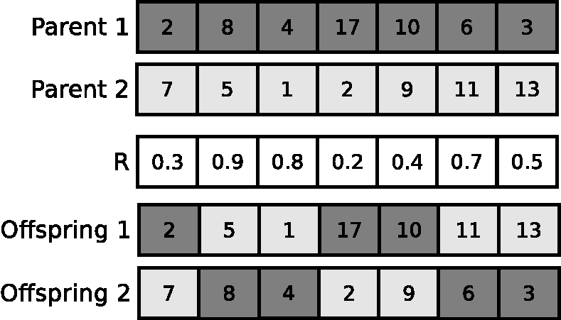
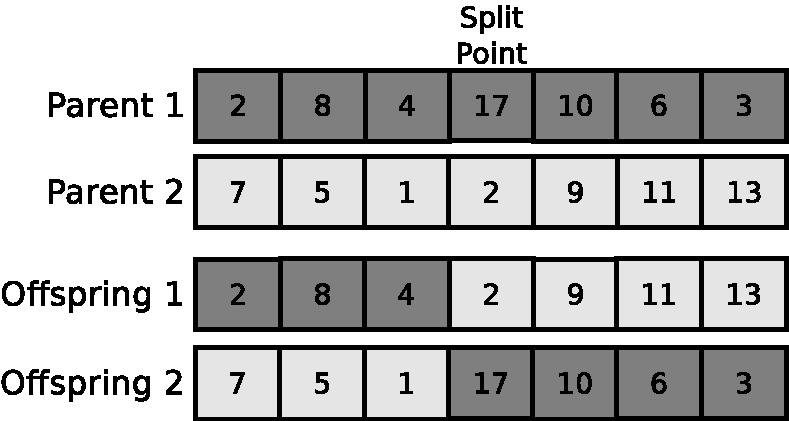
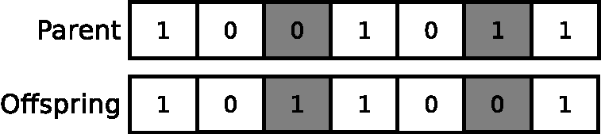

# Basic concepts about evolutionary algorithms

This section provides a detailed discussion of the basic terms and concepts that
different variants of these types of approaches share. EAs are a family of
population-based metaheuristics inspired by natural evolution. They have been
successfully applied to a large number of complex applications in different
scientific and technological fields. In natural evolution, a given environment is
filled with a population of individuals that compete in order to survive and reproduce.
Hence, since the environment can only contain a limited number of individuals, survivor
selection mechanisms are required to keep the population from growing uncontrollably.
Natural selection promotes the most competitive individuals, i.e. those that adapt
better to the environment. This phenomenon is also known as the *survival of the fittest*.
Some of these survivors will be able to reproduce with the aim of obtaining even fitter
individuals.

| **Evolutionary process**       | **Resolution of an optimisation problem** |
| ------------------------------ | ------------------------------------------|
| Population                     | Set of solutions                          |
| Individual                     | Solution                                  |
| Fitness                        | Objective function                        |
| Environment                    | Optimisation problem                      |
| Genotype, Phenotype, Chromosome| Internal representation of a solution     |
| Gene                           | Decision variable                         |
| Allele                         | Value of a decision variable              |
| Locus                          | Position of a decision variable           |

Continuing with metaphor between an evolutionary process and the resolution of
an optimisation problem (see Table above ) a *structure* or an *individual* is an encoded
solution to some problem. The codification of an individual or its internal representation
is known as the *genotype*, which is decoded to obtain the *phenotype*, or
decoded solution. If a *direct encoding* of the individuals is used, the genotype and
the phenotype are similar. A genotype is usually composed of one or more *chromosomes*,
and every chromosome in turn consists of several independent *genes*, which
take on certain values or *alleles*. A *locus* identifies the position of a gene within the
chromosome, and a set of chromosomes is called a *population*. Generally, an EA
requires both an objective function and a fitness function. The objective function
is located in the problem domain, and defines the optimality condition of the EA.
In contrast, the fitness function is situated in the algorithm domain, and measures
if a particular solution satisfies said optimality condition. Both functions, however,
are usually identical, at least in the single-objective case. Hence, an objective
function assigns a fitness value to every individual. This fitness value measures the
ability of the corresponding individual to survive and reproduce in the *environment*,
i.e. whether the solution is appropriate for the optimisation problem at hand. In this
course, something common will be to adopt a direct encoding of the individuals. In addition,
genotypes will usually consist of a unique chromosome. Consequently, we will use
the terms genotype and chromosome to refer to the internal representation of an individual.

```text
1: Initialisation. Generate the initial parent population.
2: Evaluation. Evaluate all individuals in the initial parent population by applying the
   objective function in order to assign a fitness value to every individual.
3: while (stopping criterion is not satisfied) do
4:   Parent selection. Select the individuals from the parent population to build the
     mating pool.
5:   Variation. Apply the variation operators to the mating pool so as to create the
     offspring population.
6:   Evaluation. Evaluate the generated offspring via the objective function so as to
     assign a fitness value to every offspring.
7:   Survivor selection. Select individuals from among the parents and offspring to
     survive as the new parent population for the next generation.
8: end while
```

The majority of EAs share the same generic framework (see algorithm above).
During the initialisation stage (step 1) individuals are generated to fill the initial
parent population. This initial parent population is evaluated (step 2) through the
application of the objective function so as to assign a fitness value to every individual.
Then, at each iteration or *generation* of the EA, a set of steps is repeated. Firstly, the
parents that comprise the *mating pool* (step 4) are selected via the *parent selection*
or *mating selection* mechanism. Then, the *variation operators* are applied to the
mating pool to generate the offspring population (step 5). Particularly important
among the different variation operators are the *recombination* or *crossover* operator,
as well as the *mutation* operator. Once the offspring are obtained, they have
to be evaluated (step 6) by means of the objective function in order to assign them
a fitness value. Finally, a *replacement* or *survivor selection* operator is applied
(step 7) to determine the set of individuals from among the parents and the
offspring that are going to survive as the parent population for the next generation.
These four steps are repeated until a stopping criterion (step 3) is satisfied. A flow
chart representing a generation of an EA is shown below.


From the above content, it can be observed that different components, such as the
survivor selection strategy or the variation operators, among others, have to be specified
in order to completely design an EA. Additionally, some of these components
incorporate the use of parameters, such as mutation and crossover rates, or the population
size, for instance, and consequently they must be also fixed in order to execute the
EA as designed. In particular, decisions regarding the following components must
be made during the design of an EA:

* **Individual’s representation, genotype, or chromosome**. The particular
representation will depend on the particular optimisation problem at hand, and
examples could be a binary string, a vector of discrete (integer) values and
vector of continuous (real) values, among others.
* **Population initialisation**. In the majority of cases the population is
filled with randomly generated individuals, although more sophisticated
approaches could also be applied.
* **Parent selection mechanism**. This method is responsible for selecting the individuals
from the parent population for the purpose of reproducing. One of the most
frequently used strategies is the  well-known *Binary Tournament* operator.
* **Variation operators**. The objective of the variation operators is to generate
offspring starting from the mating pool. The most widely applied variation approaches
are the crossover operator, such as the one-point crossover, and mutation operators,
like the bit-flip mutation.
* **Survivor selection strategy**. The survivor selection
mechanism is responsible for choosing, from among the current parents
and offspring, the individuals that will survive for the next generation. Examples
could be the *generational* and the *replace-worst* survivor selection strategies.
* **Stopping criterion**. One of the most frequently used stopping criteria are
the execution time or the number of evaluations involving the objective functions
of the problem being solved.

## Parent selection mechanisms

The main aim of the parent selection strategy is to select the individuals from
the parent population that are going to reproduce in order to generate the offspring.
Usually, these strategies are based on the fitness assigned to every individual. Hence,
the better the fitness of an individual, the greater its likelihood of being selected.
*Selection pressure* is the degree to which selection emphasises the fittest individuals,
and it is used by the parent selection and the survivor selection mechanisms in
order to guide the search procedure towards more promising regions. The higher
the selection pressure, the higher the probability that the fittest individuals survive.
Nevertheless, some individuals with a poor fitness should be considered for their
selection, because they might contribute with their genetic material to guide the
search process to unexplored areas where the global optimum could be found. The
fitness can be assigned in two different ways:

* *Direct fitness assignment*. The fitness values are directly associated with individuals.
* *Rank-based fitness assignment*. Each individual in the population is assigned
a rank, with this rank generally depending on its fitness value. For instance,
suppose a list in which individuals are sorted in descending order depending on
their fitness values. Hence, an individual is associated with its corresponding
rank in this list.

There exist different types of parent selection mechanisms. Some of them are based
on a direct fitness assignment, while other approaches are based on a rank-based
fitness assignment in order to carry out the selection. The most important ones
are Fitness Proportional selection, also called Roulette Wheel selection, Stochastic
Universal Sampling, Rank-based selection, and Tournament selection.

*Tournament selection* is, with no doubt, the parent selection strategy most widely used.
This operator selects one parent, and as a result, if $n$ parents have to be selected,
the operator has to be applied $n$ times. Tournament selection consists of two main steps.
Firstly, $k$ individuals are randomly selected from the current parent population using a
uniform distribution. This random selection can be performed with replacement
or without replacement. If no replacement is considered, the $k$ selected individuals
are discarded from subsequent tournaments, whereas with replacement, the $k$ selected
individuals might be randomly selected again in future tournaments. In the
second step, a probability $p$ is used to determine the winner of the tournament from
among the $k$ possible candidates. The value of $p$ represents the probability that the
fittest individual from among the $k$ possible candidates will win the tournament. If
a deterministic tournament is carried out ($p = 1$), the fittest individual, i.e. the one
with the best fitness, is always selected as the winner of the tournament. However,
stochastic variants of this selection operator can be defined by letting $p < 1$.

Something very common is to consider a deterministic binary tournament ($p = 1; k = 2$)
as the parent selection strategy. Whether replacement is used or not will
depend on the specific EA. The following figure shows its operation.



It can be observed how each circle represents an individual and the corresponding number
refers to its fitness value. In this example, the higher the fitness value, the fitter
the individual. One of the main benefits of tournament selection is that it does not
require any global knowledge about the population, since it is based on a direct
fitness assignment. As a result, it is conceptually simple and easy to implement.
Additionally, the selection pressure can be controlled by means of the tournament
size $k$. The larger the tournament size, the higher the number of randomly picked
individuals, and therefore the lower the probability that an individual with a poor
fitness will be selected. Thus, as the tournament size increases, the selection
pressure grows.

## Crossover operators

Recombination or crossover operators are responsible for generating new offspring by the
inheritance of features belonging to different parents. Crossover operators are usually binary, i.e. one or more offspring are obtained
from two parents. However, there exist variants of $n$-ary crossovers, in which $n$ parents are used to
produce the offspring. Since crossover operators are applied to the chromosome of an individual, the
internal representation selected mainly determines the way in which a particular crossover operator
is designed. The most important aspects that a crossover operator has to address are:

* **Inheritance**. The crossover operator should be able to promote the inheritance
of features that belong to both parents.
* **Validity**. The crossover should be able to produce valid offspring, i.e. solutions
that belong to the feasible region of the optimisation problem in question.

A crossover operator is usually applied by means of a crossover rate $p_c \in [0, 1]$, which
usually takes a large number.

### Uniform Crossover (UX)

This crossover works by treating every gene independently and
randomly selecting from which of the two parents a particular gene is inherited. To do so,
first a vector $R = (r_1, \ldots, r_D)$ with $D$ random values $r_i \in [0, 1]$ is generated
using a uniform distribution, where $D$ is the number of genes in a chromosome. Second,
if $r_i$ is below a given threshold (in general, 0.5) the gene $i$ of the offspring is inherited
from the first parent; otherwise it is inherited from the second parent. This second step is
performed for every gene of the offspring. In order to generate the second offspring, an inverse
mapping is used. This crossover operator is suitable for binary string, real-valued, and
discrete chromosomes.



### One Point Crossover (OPX)

First, this operator randomly chooses a locus from the chromosome
using a uniform distribution. Both parents are then split at this point, thus yielding
two offspring by the exchange of the parents' tails. It can be used with binary string,
real-valued, and discrete chromosomes.  However, its main drawback is that it suffers
from positional bias, since consecutive genes belonging to the parents' chromosomes tend
to be inherited together by the offspring.



### Simulated Binary Crossover (SBX)

This operator is classified as a parent-centric crossover.
With parent-centric crossover operators, offspring are generated closer to their parents.
Particularly, this operator simulates the operation of the \ac{opx} operator when it is applied
to binary string representations. However, the SBX operator was specifically designed to deal
with real-coded chromosomes. It is based on a probability distribution function that can be
adapted to the problem at hand by means of the distribution index $\eta$:

```math
P(\beta) = \left\{\begin{array}{ll}
                    0.5 \cdot (\eta + 1) \cdot \beta^{\eta}                 & if \ \beta \leq 1 \\
                    0.5 \cdot (\eta + 1) \cdot {1 \over {\beta^{\eta + 2}}} & if \ \beta > 1
                   \end{array} \right.
```

A value for $\beta_i$ is obtained so that the area under the probability curve is equal to a
randomly generated number $\mu_i$ in the range $[0, 1]$ using a uniform distribution. Hence,
$\beta_i$ can be calculated as follows:

```math
\beta_i = \left\{\begin{array}{ll}
                   (2 \cdot \mu_i)^{1 \over{\eta + 1}}                             & if \ \mu_i \leq 0.5 \\
                   \left[1 \over{2 \cdot (1 - \mu_i)}\right]^{1 \over{\eta + 1}} & if \ \mu_i > 0.5
                 \end{array} \right.
```

Finally, if $X = (x_1, \ldots, x_D)$ and $Y = (y_1, \ldots, y_D)$ are the parents, $V = (v_1, \ldots, v_D)$
and $Z = (z_1, \ldots, z_D)$ are the offspring, and $D$ is the number of genes in a chromosome, the values
of the genes $v_i$ and $z_i$ are calculated as follows:

```math
        \begin{array}{l}
         v_i = 0.5 \cdot [(1 + \beta_i) \cdot x_i + (1 - \beta_i) \cdot y_i] \\
         z_i = 0.5 \cdot [(1 - \beta_i) \cdot x_i + (1 + \beta_i) \cdot y_i]
        \end{array}
```

Note that $v_i$ and $z_i$ might be outside the range $[a_i, b_i]$, which
delimits the possible values that can be assigned to the gene situated at position $i$.
In this case, $v_i$ and $z_i$ have to be confined to this range.
The above process is repeated for every gene assuming a probability equal to 0.5.
Therefore, there will be cases in which the genes of both offspring directly inherit the
alleles of the parents' genes without performing the aforementioned procedure. A
distribution index $\eta = 5$ is usually applied.

## Mutation operators

Besides the crossover operator, another widely applied variation approach can be used in the
form of a mutation operator. The main difference with crossover operators is that mutation operators are
unary, i.e. they produce a single offspring starting from a unique parent.
In general, $p_m$ refers to the mutation probability applied to every gene in a chromosome,
and it is also called *mutation rate*. $p_m$ might also refer to the mutation probability for a unique
gene, however. Mutation operators are used to effect small changes in the selected individuals.
This is why they are usually applied with low values for $p_m$. Otherwise, mutation operators
might produce a highly disruptive effect. One of the most common practices is to assign the value
$1/D$ to the probability $p_m$, $D$ being the number of genes in a chromosome.
In this way, a single gene is mutated on average. The most important aspects which must be considered
during the design of a mutation operator are:

* **Ergodicity**. A mutation operator should be able to produce every solution from the search space.

* **Validity**. The offspring generated should be a valid solution belonging to the feasible region
of the search space.

* **Locality**. Locality refers to the effect produced on the phenotype when the genotype is altered.
If small changes are performed at the genotype level, small changes should be produced at the phenotype
level. This is also known as strong locality.  In contrast, if a small change is produced in the
genotype that results in a large modification in the phenotype, then the locality is weak. Strong
locality is a desirable feature in a mutation operator. In cases where a direct encoding is used,
locality is ensured if small changes are carried out by the mutation operator.

### Bit Flip Mutation (BFM)

This mutation operator, which is suitable for binary string chromosomes, allows an offspring to be
obtained by flipping the alleles of the parent's genes. Every gene in the parent is mutated with a
probability $p_m$. In cases where the gene of the parent takes the value zero, the corresponding
gene of the offspring will be assigned a one, and vice-versa. Only two bits are mutated due to $p_m$.
An example is graphically shown in the next figure.



### Uniform Mutation (UM)

The UM operator was specifically designed to deal with real-valued representations. Given a gene
$x_i$ of the parent $X = (x_1, \ldots, x_D)$, where $D$ is the number of genes in the chromosomes,
it is mutated to obtain the gene $z_i$ of the offspring $Z = (z_1, \ldots, z_D)$ as follows.
In the first place, a value $\mu_i \in [0, 1]$ is randomly generated by means of a uniform
distribution. Afterwards, the mutated gene $z_i$ of the offspring is given by:

```math
z_i = \mu_i \cdot (b_i - a_i) + a_i
```

Values $a_i$ and $b_i$ respectively are the minimum and maximum values that can be assigned to the gene $i$.
It is important to note that two different variants of the UM operator are usually considered.
The first one mutates every parent gene with probability $p_m$, while the second version mutates
a unique gene with probability $p_m$.

### Polynomial Mutation (PM)

As in the case of the UM operator, the PM operator is also appropriate for real-valued chromosomes.
Given a parent $X = (x_1, \ldots, x_D)$ where $D$ is the number of genes in a chromosome, the gene
$x_i$ is mutated to obtain the gene $z_i$ belonging to the offspring $Z = (z_1, \ldots, z_D)$ as follows:

```math
z_i = x_i + (b_i - a_i) \cdot \delta_i
```

Above, $a_i$ and $b_i$ are the lower and upper bounds that determine the possible values that can be
assigned to the gene $i$. Moreover, the value of $\delta_i$ can be calculated from the polynomial
probability distribution:

```math
P(\delta) = 0.5 \cdot (\eta + 1) \cdot (1 - |\delta|)^{\eta}
```

```math
\delta_i = \left\{ \begin{array}{ll}
                       (2 \cdot \mu_i)^{1 \over {\eta + 1}} - 1       & if \ \mu_i < 0.5 \\
                        1 - [2 \cdot (1 - \mu_i)]^{1 \over {\eta + 1}} & if \ \mu_i \geq 0.5
                   \end{array} \right.
```

$\mu_i$ is a random number that is generated in the range $[0, 1]$ using a uniform distribution,
while $\eta$ denotes the distribution index. We should note that two different versions of the
PM operator are applied herein. The first variant mutates every parent gene with probability
$p_m$, whereas the second variant mutates a unique parent gene with probability $p_m$. Finally,
a distribution index $\eta = 20$ is always used with both versions.

## Survivor selection methods

As its name indicates the survivor selection scheme is responsible for choosing the individuals from
among the parents and the offspring that will form a part of the parent population for the next
generation. Examples of survivor selection methods are:

* **Steady-State Survivor Selection**. In the case of this survivor selection strategy, a single
offspring is generated in every generation. If no individual from the parent population is worse
than the new offspring, the latter is discarded. In contrast, if several individuals belonging to
the parent population are worse than the new offspring, the worst one is replaced by the new offspring.

* **Elitism-based Generational Survivor Selection**. In every generation, $N - 1$ offspring are
generated starting from a parent population with $N$ members. Then, all parents, except the
fittest one, are discarded and replaced by the new offspring. This approach can be used without
elitism. In the above case, the whole offspring population replaces the parent population.

* **Replace Worst Survivor Selection**. This survivor selection mechanism selects the $N$ fittest
individuals from among $N$ parents and $N$ new offspring produced in every generation. This survivor
selection approach was firstly used with Evolutionary Programming. If ES-like nomenclature is used,
then this scheme is a $(\mu + \lambda)$ selection method, where $\mu = \lambda = N$.

When considering these three schemes, we see that all of them allow *overlapping-generation* EAs
to be implemented. This means that survivors are selected from among parents and offspring,
instead of only choosing survivors from the offspring population, as is the case with
*non-overlapping-generation* EAs. Examples of non-overlapping EAs would be the traditional
GA based on a pure generational survivor selection operator or the $(\mu, \lambda)$-ES, among others.
The selection pressure in an overlapping-generation EA is much higher than in the
non-overlapping-generation version of the same EA. This is because in the former EA, the number of
possible candidates to be selected is usually larger than in the latter EA. Additionally, as the
evolutionary procedure progresses, the individuals become increasingly competitive in
overlapping-generation EAs.
