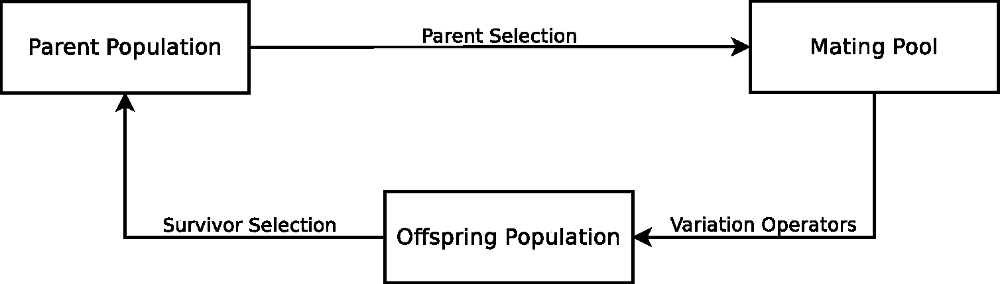

# Basic concepts about Evolutionary Algorithms

This section provides a detailed discussion of the basic terms and concepts that
different variants of these types of approaches share. EAs are a family of
population-based metaheuristics inspired by natural evolution. They have been
successfully applied to a large number of complex applications in different
scientific and technological fields. In natural evolution, a given environment is
filled with a population of individuals that compete in order to survive and reproduce.
Hence, since the environment can only contain a limited number of individuals, survivor
selection mechanisms are required to keep the population from growing uncontrollably.
Natural selection promotes the most competitive individuals, i.e. those that adapt
better to the environment. This phenomenon is also known as the *survival of the fittest*.
Some of these survivors will be able to reproduce with the aim of obtaining even fitter
individuals. 

|----------------------------------------------------------------------------|
| **Evolutionary process**       | **Resolution of an optimisation problem** |
| ------------------------------ | ------------------------------------------|
| Population                     | Set of solutions                          |
| Individual                     | Solution                                  |
| Fitness                        | Objective function                        |
| Environment                    | Optimisation problem                      |
| Genotype, Phenotype, Chromosome| Internal representation of a solution     |
| Gene                           | Decision variable                         |
| Allele                         | Value of a decision variable              |
| Locus                          | Position of a decision variable           |
|----------------------------------------------------------------------------|

<br/>

Continuing with metaphor between an evolutionary process and the resolution of
an optimisation problem (see Table above ) a *structure* or an *individual* is an encoded
solution to some problem. The codification of an individual or its internal representation
is known as the *genotype*, which is decoded to obtain the *phenotype*, or
decoded solution. If a *direct encoding* of the individuals is used, the genotype and
the phenotype are similar. A genotype is usually composed of one or more *chromosomes*,
and every chromosome in turn consists of several independent *genes*, which
take on certain values or *alleles*. A *locus* identifies the position of a gene within the
chromosome, and a set of chromosomes is called a *population*. Generally, an EA
requires both an objective function and a fitness function. The objective function
is located in the problem domain, and defines the optimality condition of the EA.
In contrast, the fitness function is situated in the algorithm domain, and measures
if a particular solution satisfies said optimality condition. Both functions, however,
are usually identical [70], at least in the single-objective case. Hence, an objective
function assigns a fitness value to every individual. This fitness value measures the
ability of the corresponding individual to survive and reproduce in the *environment*,
i.e. whether the solution is appropriate for the optimisation problem at hand. We
should note that herein direct encoding of the individuals is always used. In addition,
genotypes consist of a unique chromosome. Consequently, the terms genotype and chromosome
refer to the internal representation of an individual.

```
1: Initialisation. Generate the initial parent population.
2: Evaluation. Evaluate all individuals in the initial parent population by applying the
   objective function in order to assign a fitness value to every individual.
3: while (stopping criterion is not satisfied) do
4:   Parent selection. Select the individuals from the parent population to build the
     mating pool.
5:   Variation. Apply the variation operators to the mating pool so as to create the
     offspring population.
6:   Evaluation. Evaluate the generated offspring via the objective function so as to
     assign a fitness value to every offspring.
7:   Survivor selection. Select individuals from among the parents and offspring to
     survive as the new parent population for the next generation.
8: end while
```

The majority of EAs share the same generic framework (see algorithm above).
During the initialisation stage (step 1) individuals are generated to fill the initial
parent population. This initial parent population is evaluated (step 2) through the
application of the objective function so as to assign a fitness value to every individual.
Then, at each iteration or *generation* of the EA, a set of steps is repeated. Firstly, the
parents that comprise the *mating pool* (step 4) are selected via the *parent selection*
or *mating selection* mechanism. Then, the *variation operators* are applied to the
mating pool to generate the offspring population (step 5). Particularly important
among the different variation operators are the *recombination* or *crossover* operator,
as well as the *mutation* operator. Once the offspring are obtained, they have
to be evaluated (step 6) by means of the objective function in order to assign them
a fitness value. Finally, a *replacement* or *survivor selection* operator is applied
(step 7) to determine the set of individuals from among the parents and the
offspring that are going to survive as the parent population for the next generation.
These four steps are repeated until a stopping criterion (step 3) is satisfied. A flow
chart representing a generation of an EA is shown below.



