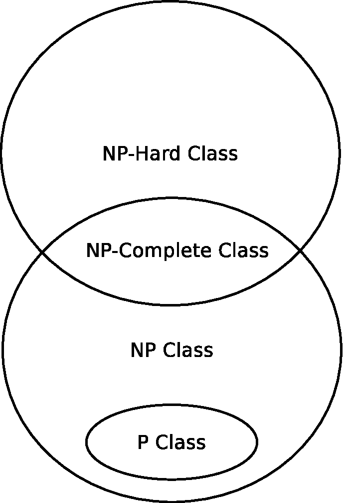
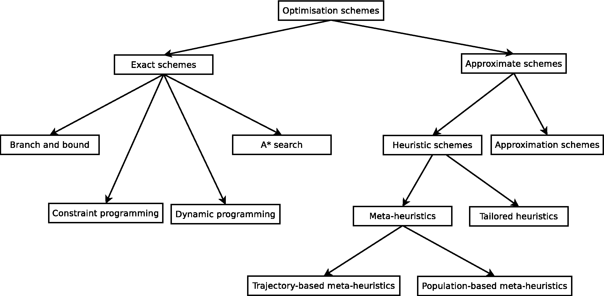

# Optimisation problems and optimisation schemes

This section presents the basic concepts and the nomenclature that will be used
throughout the rest of this course. Particularly, the description and formal
definition of an optimisation problem in the single-objective field is given.
Moreover, a taxonomy which classifies the optimisation schemes available for
dealing with optimisation problems is provided.

## Single-objective problems

Optimisation is one of the most important topics for a wide range of fields in science
and technology, such as computer science, operational research, and artificial
intelligence [75], as well as in other areas like finance, business, and medicine [211].
Given an optimisation problem, there exist different feasible solutions, and therefore
the main aim of optimisation is to find the best possible solution to a problem
from among all feasible solutions. Hence, solving an optimisation problem requires
finding said best solution by taking into consideration certain objectives while at
the same time satisfying certain constraints.

In order to obtain a solution for an optimisation problem, several decisions involving
the problem domain must be made. For example, consider a variant of the knapsack
problem [227, 235] in which a set of items, each with its corresponding profit and
weight, is given. The optimisation problem consists of deciding which items from
the set of candidate items will be stored into the knapsack so that the global profit
is maximised, while at the same time satisfying the constraint of maximum weight
that the knapsack is able to support. Different decisions are represented by a set
of decision variables, which is usually called the decision vector, and decisions are
carried out by assigning values to each variable belonging to the decision vector.
Continuing with the example of the knapsack problem, a possible decision vector
could contain a set of ones and zeros indicating whether an item is selected to be
stored or not.

The quality of a decision vector or solution has to be determined using certain criteria,
which are expressed as a computable function of the decision variables. Considering
this function, optimisation problems can be classified as Single-objective Optimisation
Problems or Multi-objective Optimisation Problems (MOPs). In singleobjective
optimisation problems a scalar function is defined, while in the multiobjective
field a vector or multiple objective function is applied. In the knapsack
example, if a unique knapsack is considered, a scalar function is defined, and therefore
a single-objective variant of the knapsack problem is addressed, whereas if multiple
knapsacks are taken into account, each of them with its associated function, a
multi-objective variant of the problem is defined.

The single-objective optimisation problem, as described in Definition 1 [70], can be
handled using a wide variety of optimisation schemes.

A general **single-objective optimisation problem** is defined as minimising (or
maximising) $f(x)$ subject to $g_{i}(x) \leq 0$, $i = \{1, \ldots, m\}$ and
$h_{j}(x) = 0$, $j = \{1, \ldots, p\}$ $x \in \Omega$.

A solution or decision vector $x = (x_1, \ldots, x_n)$ is an $n$-dimensional vector.
It is important to note that $x$ can be a vector of continuous or discrete decision variables
(or even a mix), whereas the scalar function $f$ can also be continuous or discrete.
Moreover, $g_{i}(x) \leq 0$ and $h_{j}(x) = 0$ are inequality and equality constraints that
must be satisfied while optimising (minimising or maximising ) $f(x)$.
Hence, $\Omega$ contains all possible solutions $x$ that can be used to satisfy an evaluation of $f(x)$
and its constraints, i.e. $\Omega$ is the set that determines the {\it feasible region} of $x$.

The process of finding the global optimum---or global optima---of any function is referred to as
*Global Optimisation*. From now on, and without loss of generality, a single-objective optimisation
problem to be minimised will be considered. Taking this into account, the global minimum of a
single-objective problem [16] is defined as follows.

Given a function $f: \Omega \subseteq \mathbb{R}^{n} \rightarrow \mathbb{R}$,
$\Omega \neq \emptyset$ for $x^\* \in \Omega$ the value $f^{\*} \stackrel{\vartriangle}{=} f(x^{*}) > -\infty$ is called a **global minimum**
if and only if

```math
   \forall x \in \Omega: f(x^{*}) \leq f(x)
```

Thus, $x^{\*}$ is called the *global minimum solution* and $f$ is denoted as the {\it objective function}.
Note that the inequality in the above equation indicates that several global minimum solutions could
exist for a single-objective optimisation problem.  The aim of obtaining the global minimum solution
(or solutions) is therefore known as the *global optimisation problem*.

## Optimisation schemes

A wide range of optimisation schemes has been designed for dealing with optimisation
problems.  These optimisation schemes can be classified using different taxonomies.
The classification proposed in [328] is considered and exposed herein.
It differentiates between  *exact algorithms* and *approximate algorithms*.
%
In order to use this classification, some notions regarding complexity theory are
first given in this section.
%
Among the approximate algorithms, *meta-heuristics* emerge as general optimisation
techniques and yield solutions of acceptable quality in a reasonable execution
time frame when solving a wide range of complex optimisation problems.
%
Meta-heuristics, in turn, can be divided into *trajectory-based methods* and
*population-based schemes*.
%
Trajectory-based methods only have to consider a unique solution, whereas population-based
approaches have to maintain a set of candidate solutions during the entire optimisation procedure.

### Complexity theory

In this section, some results on tractability of problem solving are given.
Computational problems represent tasks that, in principle, can be solved by a computer.
A decision problem is a special type of computational problem whose answer is
either "yes" or "no". Decision problems can be *decidable* or *undecidable*.
The latter category includes problems for which an algorithm that solves
them will never exist, even having an unlimited amount of computational resources
and time [324]. An example of an undecidable problem is the *halting problem* [334].
Determining the resources required by algorithms and problems is important.
This is precisely the goal of complexity analysis.

#### Algorithm complexity

Algorithms need time and space (memory) as resources for solving a problem.
An algorithm's complexity can prove useful when analysing its limitations and predicting its
resource requirements with a view to terminating its execution.
If the time frame is considered, the complexity of an algorithm is the number of steps
required to solve a problem whose size is equal to $n$, and is usually defined
considering the worst-case analysis. Knowing the exact number of steps is not necessary,
but an asymptotic bound of this number is required.

The $O$-notation [39] is one of the most frequently used when analysing algorithms.
It is based on the asymptotic analysis and it can be used to compute the time and/or
space complexity of an algorithm. The asymptotic analysis of algorithms allows
characterising the growth rate of their complexity as a function of the problem size.
It is important to note that there exist two other well-known notations for analysing
algorithms. They are the $\Omega$-notation and the $\Theta$-notation [39].

If we consider the $O$-notation, an algorithm has a complexity
$f(n) = O(g(n))$ if there exist positive constants $n_0$ and $c$ such
that $\forall n > n_0, f(n) \leq c \cdot g(n)$

In other words, the function $g(n)$ is an upper bound for the function $f(n)$, i.e.
$f(n)$ grows asymptotically no higher than $g(n)$.

An algorithm is a **polynomial-time algorithm** if its time complexity is $O(p(n))$,
where $p(n)$ is a polynomial function of $n$.

Hence, a polynomial-time algorithm has a polynomial time complexity of $O(n^k)$, where $k$
is the degree of the upper bound polynomial function.

An algorithm is an **exponential-time algorithm** if its time complexity is $O(c^n)$,
where $c > 1$ is a real constant.

#### Problem complexity

A problem is *tractable* if there exists a polynomial-time algorithm that solves it.
In contrast, a problem is *intractable* if no polynomial-time algorithm exists that solves it.
Complexity theory commonly deals with decision problems. It also address other types of problems,
such as function problems and optimisation problems, among others.
However, we should note that any function problem or optimisation problem can always be reduced
to a decision problem. One of the main objectives of computational theory is to categorise
problems into complexity classes. A complexity class is a set of problems of related complexity.
Two of the most important complexity classes are $P$ and $NP$.

The **complexity class P** contains all decision problems which can be solved by a
deterministic algorithm in polynomial time.

A deterministic algorithm is polynomial for a decision problem $A$ if its complexity,
assuming the worst-case, is bounded by a polynomial function $p(n)$ where $n$ is the
input size of a given instance $\alpha$. Examples of problems belonging to the
complexity class $P$ are minimum spanning tree, shortest path problems,
and maximum flow networks, among others [74].

The **complexity class NP** contains all decision problems which can be solved
by a non-deterministic Turing machine in polynomial time.

We should note that each decision problem in $P$ is also a member of the class $NP$.
However, whether or not $P = NP$ is an open research question [72].
In other words, it has been shown that for every decision problem belonging to
the class $P$ there exists a non-deterministic Turing machine that can solve it
in polynomial time. However, it is not known whether for every decision problem
belonging to the class $NP$ there exists a deterministic algorithm that solves
it in polynomial time.

A decision problem $A$ is **reduced polynomially** to a decision problem $B$ if,
for all input instances $\alpha$ for $A$, an input instance $\beta$ for $B$ can be
built in polynomial time, such that the answer to the instance $\alpha$ is "yes"
if and only if the answer to the instance $\beta$ is "yes".

A decision problem $A \in NP$ is **NP-complete** if all other problems that
belong to the class $NP$ can be reduced polynomially to $A$.

A direct claim of this definition is that if a deterministic polynomial-time algorithm
exists to solve an $NP$-complete problem, then all problems of class $NP$ might
be solved in polynomial time. $NP$-complete problems are the hardest $NP$ problems
to solve.

A problem $A$ is $NP$-hard if and only if there exists an $NP$-complete problem $B$
that can be reduced polynomially to $A$.

Informally, $NP$-hard problems are at least as hard as $NP$-complete problems.
However, it is important to note that $NP$-hard problems do not have to be included
in the class $NP$, since not all of them are decision problems. They can be
optimisation problems, for instance. Moreover, some $NP$-hard problems are not
included in the $NP$ class, despite being decision problems.
For instance, the halting problem is an $NP$-hard problem. It is also a decision
problem, but since it is undecidable, it is outside the class $NP$.
Finally, if an optimisation problem has an associated $NP$-complete decision problem,
said optimisation problem is $NP$-hard. The figure below shows the relationships among
the classes $P$, $NP$, $NP$-complete and $NP$-hard, considering $P \neq NP$.



$NP$-hard problems usually require exponential-time algorithms (unless $P = NP$) in
order to obtain the optimal solutions.
Most real complex applications are categorised as $NP$-hard optimisation problems.
Examples of $NP$-hard problems are scheduling problems, routing and covering problems,
or knapsack and cutting problems, among others [74].

Depending on a problem's complexity, it can be solved by *exact algorithms* or
by *approximate algorithms*. Exact approaches are able to obtain solutions
whose optimality is ensured. However, for $NP$-complete problems exact
algorithms cannot be applied (unless $P = NP$) since they become
non-polynomial-time algorithms, and therefore they are not able to provide
optimal solutions in a reasonable time for large instances.

In contrast, approximate or {\it heuristic} schemes are able to generate
high-quality solutions, even optimal ones, in a reasonable time. However,
using approximate algorithms does not guarantee that the optimal
solution will be found.

The next figure shows a possible taxonomy [328], which classifies
optimisation methods into exact and approximate schemes.


